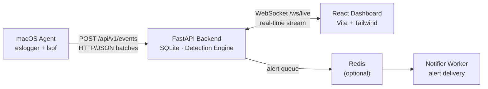
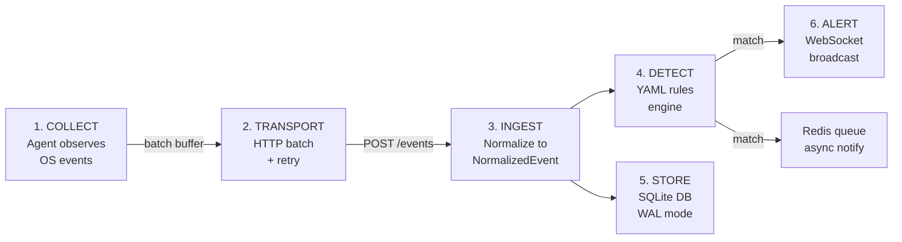

# HomeSOC

**Home Security Operations Center** — a real-time, agent-based security monitoring system for macOS that runs entirely on your local network. No cloud dependencies.


---

## What Is This?

HomeSOC is a lightweight SOC (Security Operations Center) you can run at home. It deploys an agent on your Mac that collects security-relevant events — process executions, file changes, network connections, authentication attempts — and streams them to a central backend for detection and alerting.

A real-time dashboard gives you full visibility into what's happening on your machine.

### Key Features

- **Real-time event streaming** via WebSocket live feed
- **Detection engine** with YAML-based rules (single-event and threshold-based)
- **macOS agent** powered by Apple's Endpoint Security framework (`eslogger`) + `lsof`
- **Interactive dashboard** with timeline charts, alert panels, and agent management
- **Dual authentication** — API key for agents, JWT with bcrypt for dashboard users
- **Rate limiting** — per-IP rate limiting with standard X-RateLimit headers
- **Redis integration** — async alert notification queue and rule re-evaluation
- **Zero cloud dependencies** — everything runs locally on your network
- **SQLite with WAL mode** for fast concurrent reads/writes

---

## Architecture



### Event Flow



---

## Project Structure

```
HomeSoc/
├── compose.yaml          # Docker Compose (backend + dashboard + Redis + notifier)
├── shared/               # Pydantic schemas, enums, protocol models
│   ├── schemas.py        # NormalizedEvent, Alert, AgentInfo
│   ├── enums.py          # Platform, EventCategory, Severity
│   └── protocol.py       # Transport models (EventBatch, Heartbeat)
│
├── backend/              # FastAPI server
│   ├── main.py           # App entry point, lifespan, rate limiting, WebSocket
│   ├── config.py         # Settings via environment variables
│   ├── api/              # REST endpoints (events, alerts, agents, rules, auth, demo, setup)
│   ├── db/               # SQLite connection, repository, schema
│   ├── engine/           # Detection engine + YAML rule loader
│   ├── ingestion/        # Event processing pipeline
│   ├── worker/           # Redis client + notifier worker
│   └── rules/            # YAML detection rule files
│
├── agents/
│   ├── common/           # Base agent, HTTP transport with batching
│   └── macos/            # macOS agent (eslogger + lsof collectors)
│
├── dashboard/            # React 18 + Vite + TypeScript + Tailwind
│   └── src/
│       ├── api/          # REST client + WebSocket manager
│       ├── components/   # Dashboard widgets, event table, layout
│       ├── hooks/        # useWebSocket, useAlerts, useEvents
│       ├── pages/        # Dashboard, Events, Alerts, Agents, Rules, Settings, Guide
│       └── contexts/     # Settings context with localStorage persistence
│
├── scripts/
│   ├── generate_test_events.py   # Standalone test event generator
│   ├── refresh.py                # Rule re-evaluation (Redis + bounded concurrency)
│   └── demo.sh                   # Full demo walkthrough script
│
├── tests/                # pytest test suite (43 tests)
├── docs/                 # Documentation and runbooks
└── .github/workflows/    # CI pipeline (pytest on push)
```

---

## Getting Started

### Quick Start with Docker (Recommended)

The fastest way to run HomeSOC (backend + dashboard + Redis + notifier):

```bash
docker compose up --build
```

This starts:
- **Backend** at `http://localhost:8443`
- **Dashboard** at `http://localhost:8080`
- **Redis** at `localhost:6379`
- **Notifier worker** (consumes alert queue)

The dashboard proxies API and WebSocket requests to the backend automatically.

To set a fixed API key, create a `.env` file in the project root:

```
HOMESOC_API_KEY=your-secret-key-here
```

To stop everything:

```bash
docker compose down
```

> **Note:** Docker runs the backend, dashboard, Redis, and notifier. The macOS agent still runs natively on your machine — it needs OS-level access for security monitoring.

---

### Manual Setup

#### Prerequisites

- **Python 3.13+** (with `uv` recommended, or `pip`)
- **Node.js 18+**
- **macOS 13+** (`eslogger` requires Ventura or later)

#### 1. Set Up Python Environment

**Option A — Using `uv` (recommended):**

```bash
uv venv
source .venv/bin/activate
uv pip install -r backend/requirements.txt
```

**Option B — Using `venv` + `pip`:**

```bash
python3 -m venv .venv
source .venv/bin/activate
pip install -r backend/requirements.txt
```

#### 2. Start the Backend

```bash
python -m uvicorn backend.main:app --host 0.0.0.0 --port 8443 --reload
```

The backend will start on `http://localhost:8443`. On first run it generates a random API key and prints it to the console:

```
[HomeSOC] API Key: <your-key-here>
[HomeSOC]   Set HOMESOC_API_KEY env var to use a fixed key
[HomeSOC]   Agents must send X-API-Key header on all requests
```

To use a fixed key across restarts, set the environment variable:

```bash
export HOMESOC_API_KEY="your-secret-key-here"
```

API docs are available at `http://localhost:8443/docs`.

#### 3. Start the Dashboard

```bash
cd dashboard && npm install && npm run dev
```

Open **http://localhost:5173** in your browser.

#### 4. Run the macOS Agent

> Requires `sudo` and **Full Disk Access** for your terminal app.
> Grant it in: **System Settings > Privacy & Security > Full Disk Access**

```bash
sudo python agents/macos/main.py --backend-url http://localhost:8443 --agent-id <your-agent-id> --api-key <your-api-key>
```

The agent reads the key from `--api-key` or the `HOMESOC_API_KEY` environment variable.

The easiest way to get the exact command is to add your machine on the **Agents page** in the dashboard and click the **Setup** button — it shows the command with your API key and agent ID pre-filled.

#### 5. Generate Test Events (Optional)

If you want to see the dashboard in action without running a real agent:

```bash
python scripts/generate_test_events.py --api-key <your-api-key>
```

Options: `--url`, `--count`, `--interval`, `--api-key` (or set `HOMESOC_API_KEY`)

You can also generate events from the dashboard UI using the "Generate Test Events" button.

---

## macOS Agent

The agent uses two collectors:

| Collector | Source | Events |
|-----------|--------|--------|
| **eslogger** | Apple Endpoint Security framework | Process exec, file create/open/rename, auth attempts, signals |
| **lsof** | Active network connections (polled every 15s) | Outbound connections, process → IP mapping |

**Requirements:**
- `sudo` — eslogger requires root access
- Full Disk Access granted to your terminal app in System Settings → Privacy & Security

---

## Detection Rules

Rules are defined in YAML files under `backend/rules/`. HomeSOC supports two rule types:

### Single-Event Rules

Fire immediately when an event matches all conditions.

### Threshold Rules

Fire when a condition is met N times within a time window.

### Built-in Rules

| Rule | Severity | Description |
|------|----------|-------------|
| Suspicious Shell Spawn | HIGH | Shell spawned from a non-terminal parent process |
| Execution from /tmp | MEDIUM | Process running from /tmp, /var/tmp, or Downloads |
| Suspicious Tool Usage | HIGH | Known recon/exfil tools (nmap, nc, netcat, tcpdump, etc.) |
| LaunchDaemon Created | HIGH | New LaunchDaemon or LaunchAgent plist (persistence) |
| Unusual Outbound Port | MEDIUM | Outbound connection on uncommon ports |
| Known C2 Port | CRITICAL | Connection to common C2 ports (4444, 1337, 6667, etc.) |
| Brute Force Auth | CRITICAL | 5+ failed authentication attempts within 60 seconds |

### Writing Custom Rules

Create a new `.yml` file in `backend/rules/`:

```yaml
rules:
  - id: my-custom-rule
    name: My Custom Detection
    type: single          # or "threshold"
    platform: macos
    severity: high
    description: Detects something suspicious
    conditions:
      category: process
      event_type: process_exec
      match:
        process_name: suspicious-binary
```

Rules are loaded automatically on backend startup.

---

## Event Categories

| Category | Examples |
|----------|---------|
| **Process** | Executions, signals, suspicious binaries |
| **File** | Create, open, rename operations |
| **Network** | Outbound connections, unusual ports, DNS |
| **Authentication** | Login attempts, auth failures |

### Severity Levels

`info` > `low` > `medium` > `high` > `critical`

---

## Configuration

The backend is configured via environment variables with the `HOMESOC_` prefix:

| Variable | Default | Description |
|----------|---------|-------------|
| `HOMESOC_HOST` | `127.0.0.1` | Bind address |
| `HOMESOC_PORT` | `8443` | Server port |
| `HOMESOC_DB_PATH` | `backend/data/events.db` | SQLite database path |
| `HOMESOC_RULES_DIR` | `backend/rules/` | Detection rules directory |
| `HOMESOC_CORS_ORIGINS` | `localhost:5173,3000` | Allowed CORS origins |
| `HOMESOC_EVENT_RETENTION_DAYS` | `7` | Event retention period |
| `HOMESOC_API_KEY` | *(auto-generated)* | API key for agent and destructive endpoints |
| `HOMESOC_JWT_SECRET` | *(auto-generated)* | JWT signing secret for dashboard auth |
| `HOMESOC_REDIS_URL` | `redis://localhost:6379/0` | Redis connection URL (optional) |

---

## API Endpoints

Endpoints marked with **[key]** require the `X-API-Key` header. Endpoints marked with **[jwt]** require a Bearer token.

| Method | Endpoint | Auth | Description |
|--------|----------|------|-------------|
| `POST` | `/api/v1/events` | [key] | Ingest event batch |
| `GET` | `/api/v1/events` | | Query events (filters: category, severity, agent_id) |
| `GET` | `/api/v1/events/{id}` | | Get single event |
| `DELETE` | `/api/v1/events` | [key] | Clear all events |
| `GET` | `/api/v1/alerts` | | List alerts (filters: status, severity) |
| `PATCH` | `/api/v1/alerts/{id}` | | Update alert status |
| `DELETE` | `/api/v1/alerts` | [key] | Clear all alerts |
| `POST` | `/api/v1/register` | [key] | Register agent |
| `POST` | `/api/v1/heartbeat` | [key] | Agent heartbeat |
| `GET` | `/api/v1/agents` | | List agents |
| `POST` | `/api/v1/agents` | | Manually register agent |
| `POST` | `/api/v1/agents/{id}/stop` | [key] | Stop agent remotely |
| `POST` | `/api/v1/agents/{id}/resume` | | Resume agent |
| `DELETE` | `/api/v1/agents/{id}` | [key] | Remove agent |
| `GET` | `/api/v1/rules` | | List detection rules |
| `GET` | `/api/v1/dashboard/summary` | | Dashboard summary stats |
| `POST` | `/api/v1/auth/register` | | Create user account |
| `POST` | `/api/v1/auth/login` | | Login (returns JWT) |
| `GET` | `/api/v1/auth/me` | [jwt] | Current user info |
| `GET` | `/api/v1/auth/users` | [jwt] | List users (admin only) |
| `POST` | `/api/v1/demo/generate` | | Generate test events |
| `GET` | `/api/v1/setup/agent-instructions` | | Get agent setup commands with API key |
| `WS` | `/ws/live` | | Real-time event/alert stream |
| `GET` | `/health` | | Health check |

Full interactive docs available at `http://localhost:8443/docs` when the backend is running.

---

## Tech Stack

**Backend:** Python 3.13, FastAPI, Uvicorn, Pydantic, aiosqlite, PyYAML, httpx, python-jose, bcrypt

**Frontend:** React 18, TypeScript, Vite, Tailwind CSS, Recharts, Lucide Icons, React Router

**Storage:** SQLite with WAL mode

**Message Broker:** Redis (optional, for alert notification queue)

**Agent Transport:** Async HTTP with batching, buffering, and retry logic

---

## Security

HomeSOC uses two authentication mechanisms:

**API Key** (for agents):
- The backend generates a random key on startup if `HOMESOC_API_KEY` is not set
- Agents send the key via the `X-API-Key` HTTP header on every request
- Key comparison uses constant-time `hmac.compare_digest` to prevent timing attacks

**JWT** (for dashboard users):
- User passwords are hashed with bcrypt before storage
- Login returns a signed JWT token with role (admin/viewer) and expiration
- Protected routes validate the token and enforce role-based access
- Token rotation: change `HOMESOC_JWT_SECRET` and restart to invalidate all sessions

**General:**
- The default bind address is `127.0.0.1` — the API is not exposed to the network unless you explicitly change `HOMESOC_HOST`
- Rate limiting: 120 requests per minute per IP, with `X-RateLimit-Limit`, `X-RateLimit-Remaining`, and `X-RateLimit-Reset` headers

---

## Testing

```bash
# From the project root (with venv activated)
uv pip install pytest pytest-asyncio anyio  # or: pip install pytest pytest-asyncio anyio
PYTHONPATH=. python -m pytest tests/ -v
```

43 tests across 4 files covering:
- CRUD happy-path (events, alerts, agents) via TestClient
- JWT authentication (register, login, expired token, role enforcement)
- API key auth (accept/reject)
- Detection engine (single-event, threshold per-source, rule completeness)
- Data retention (event/alert purge lifecycle)
- Redis idempotency (refresh script batch processing)
- WebSocket broadcast (concurrent send, dead client cleanup)

---

## Demo

Run the full demo walkthrough:

```bash
./scripts/demo.sh
```

This starts the backend and dashboard, registers a user, generates test events, queries the API, and runs the test suite.

---

## AI Assistance

This project was developed with the assistance of Claude (Anthropic) via Claude Code CLI. AI was used for:

- **Code scaffolding** — initial project structure, Pydantic schemas, FastAPI endpoint patterns
- **Detection rule design** — YAML rule format and matching logic for single-event and threshold rules
- **Bug fixing** — identifying data mutation bugs in serialization, threshold detection scoping issues
- **Documentation** — README structure, API endpoint tables, architecture diagrams
- **Test writing** — pytest fixtures, async test patterns, edge case identification

All AI-generated code was reviewed, tested locally, and verified against real macOS endpoint security events before being committed.
