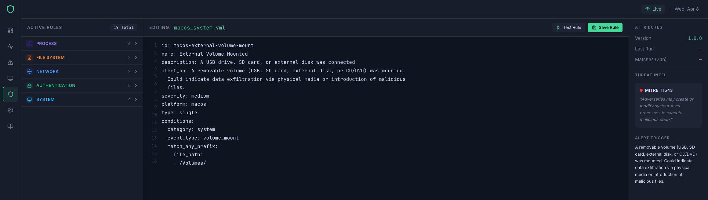
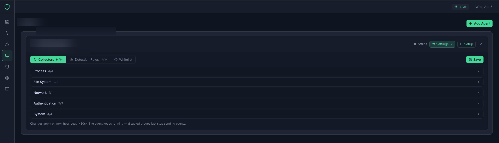
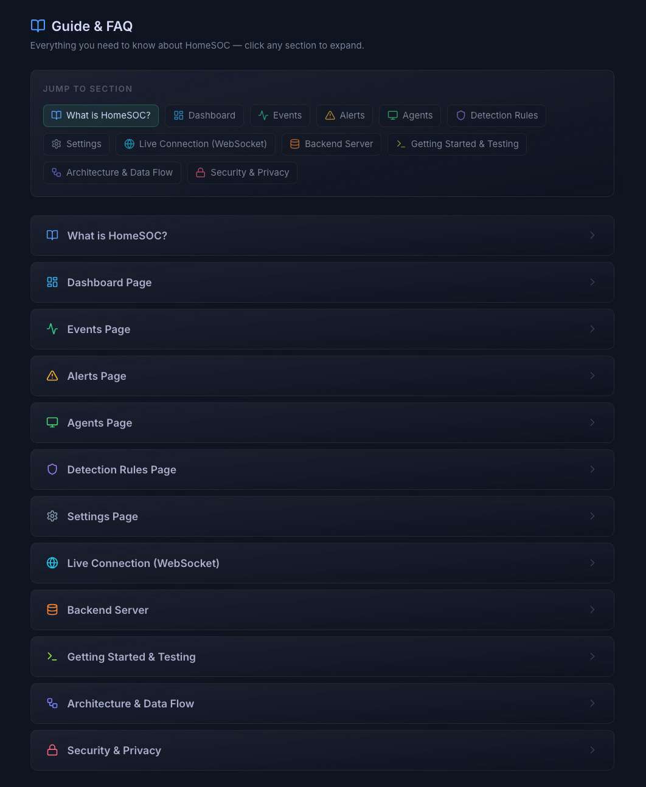
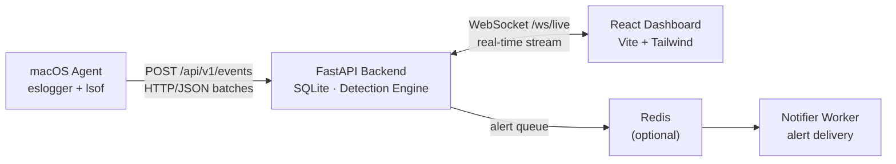

# HomeSOC

**Home Security Operations Center** — real-time security monitoring for macOS. Runs entirely on your local network, no cloud required.


---

## What It Does

An agent runs on your Mac and collects security events — process executions, file changes, network connections, auth attempts. Events stream to a local backend that runs detection rules and fires alerts. A live dashboard shows everything in real time.

## Showcase

### Dashboard — Security Overview


### Dashboard — Live Event Feed


### Detection Rules


### Agents


### Guide & FAQ


---

## Architecture



---

## Quick Start

### Docker (recommended)

```bash
docker compose up --build
```

- **Dashboard** → http://localhost:8080
- **Backend API** → http://localhost:8443

To set a fixed API key, create a `.env` file in the project root:
```
HOMESOC_API_KEY=your-secret-key-here
```

### Manual (dev mode — hot reload)

**Prerequisites:** Python 3.13+, Node.js 18+, macOS 13+

```bash
# Python env (from project root)
uv venv && source .venv/bin/activate
uv pip install -r backend/requirements.txt

# Terminal 1 — backend
python -m uvicorn backend.main:app --host 0.0.0.0 --port 8443 --reload

# Terminal 2 — dashboard
cd dashboard && npm install && npm run dev
```

Open **http://localhost:5173**.

---

## Running the Agent

> Requires `sudo` and **Full Disk Access** for your terminal app.  
> Grant it in: System Settings → Privacy & Security → Full Disk Access
>
> **Important:** Both your terminal app **and** `/usr/bin/python3` must be in the Full Disk Access list — macOS checks the Python process specifically when it spawns `eslogger`.

The easiest way: go to the **Agents page** in the dashboard, click **Add Agent**, then click **Setup** — it shows the exact command with your API key pre-filled.

Or run it directly from the project root:

```bash
sudo python3 agents/macos/main.py \
  --backend-url http://localhost:8443 \
  --agent-id <your-agent-id> \
  --api-key <your-api-key>
```

To stop the agent: press `Ctrl+C` in the terminal where it's running.

Once the agent is registered, open its settings panel from the **Agents page**. It has three tabs:

- **Collectors** — toggle individual event groups (process execution, file access, network, SSH, sudo, volume mounts, etc.). Changes apply on the next heartbeat (~30s).
- **Detection Rules** — enable or disable specific detection rules for this agent. Disabled rules generate no alerts; events are still collected.
- **Whitelist** — suppress specific events by field match (exact, prefix, or contains) before they are stored. Matched events never appear in the feed, events table, or trigger alerts.

---

## Detection Rules

YAML files in `backend/rules/`. Two types:
- **Single-event** — fires immediately when an event matches
- **Threshold** — fires when N matches occur within a time window

**Built-in rules:**

| Rule | Severity |
|------|----------|
| Suspicious Shell Spawn | HIGH |
| Execution from /tmp | MEDIUM |
| Suspicious Recon Tool (nmap, nc, etc.) | HIGH |
| LaunchDaemon Created | HIGH |
| Unusual Outbound Port | MEDIUM |
| Known C2 Port | CRITICAL |
| Brute Force Auth | CRITICAL |
| External Volume Mount | INFO |
| Non-Apple Kernel Extension | HIGH |
| Remote Thread Injection | CRITICAL |
| Task Port Inspection (non-system processes) | HIGH |
| Privilege Escalation to Root | CRITICAL |
| Sudo Command Executed | MEDIUM |
| Sudo Denied (repeated failures) | HIGH |
| SSH Login | INFO |
| SSH Login Failures | HIGH |
| Screen Sharing Attached | MEDIUM |
| Malware Detected (XProtect) | CRITICAL |
| Sensitive File Deleted | HIGH |

Rules can be toggled per-agent from the **Agents page → Settings → Detection Rules** tab.

The **Events** table is paginated at 75 rows per page with First / Prev / page-number / Next / Last navigation.

---

## Configuration

Environment variables (prefix: `HOMESOC_`):

| Variable | Default | Description |
|----------|---------|-------------|
| `HOMESOC_API_KEY` | *(auto-generated)* | Agent auth key |
| `HOMESOC_JWT_SECRET` | *(auto-generated)* | Dashboard JWT secret |
| `HOMESOC_PORT` | `8443` | Backend port |
| `HOMESOC_DB_PATH` | `backend/data/events.db` | SQLite path |
| `HOMESOC_EVENT_RETENTION_DAYS` | `7` | How long to keep events |
| `HOMESOC_REDIS_URL` | `redis://localhost:6379/0` | Redis (optional) |

---

## Testing

```bash
PYTHONPATH=. python -m pytest tests/ -v
```

---

## AI Assistance

Built with Claude (Anthropic) via Claude Code. AI assisted with scaffolding, detection rule design, and bug fixing. All code was reviewed and tested against real macOS security events before committing.
